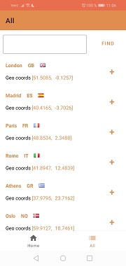
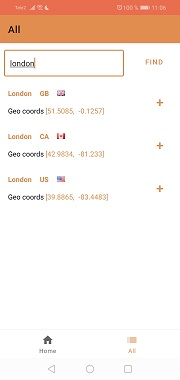

# WeatherApplication
## Приложение для прогноза погоды
#### Использованные технологии

+ Retrofit
+ паттерн Repository
+ Android Architecture Components
  + ViewModel
  + LiveData
  + Room
  + WorkManager для создания уведомлений 
  + Navigation
  + Hilt (Dependency Injection)

  '  '   
     
 
