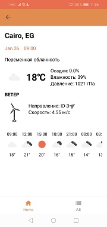

# WeatherApplication
## Приложение для прогноза погоды
### Архитектура приложения

- Retrofit
- паттерн Repository
+ Android Architecture Components
  + ViewModel
  + LiveData
  + Room
  + WorkManager для создания уведомлений 
  + Navigation
  + Hilt (Dependency Injection)

  
