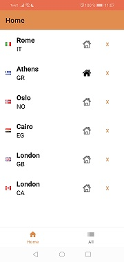

# WeatherApplication
## Приложение для прогноза погоды
### Функционал 
#### Имеется список городов, у города можно посмотреть прогноз погоды на 5 дней. Есть возможность добавлять города, используя поиск. Добавленные города локально хранятся в БД. Для "домашнего" города  регулярно (примерно 2 раза в день) приходят уведомления с ближайшим прогнозом.
#### Использованные технологии

+ Retrofit
+ паттерн Repository
+ Android Architecture Components
  + ViewModel
  + LiveData
  + Room
  + WorkManager для создания уведомлений 
  + Navigation
  + Hilt (Dependency Injection)

 &nbsp;&nbsp;    
 &nbsp;&nbsp;   &nbsp;&nbsp;
    
#### Пример уведомления
 

 
